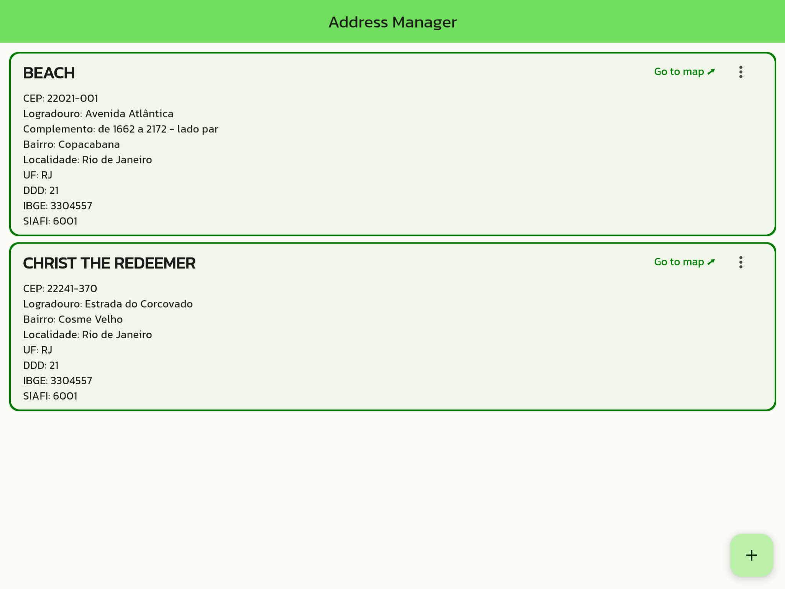

# DIO's Address Manager challenge

This is the [Flutter Specialist Formation](https://www.dio.me/bootcamp/formacao-flutter-specialist)'s Address manager challenge answer project from [Digital Innovation One](https://dio.me)

## Challenge Checklist

✅ Create a Flutter application

✅ Create an Address class in [Back4App](https://www.back4app.com/)

✅ Get an address from [Viacep](https://viacep.com.br/) and register it in [Back4App](https://www.back4app.com/)

✅ List the Addresses registered as a list and allow it's editing and exclusion

## Bonus

GraphQL