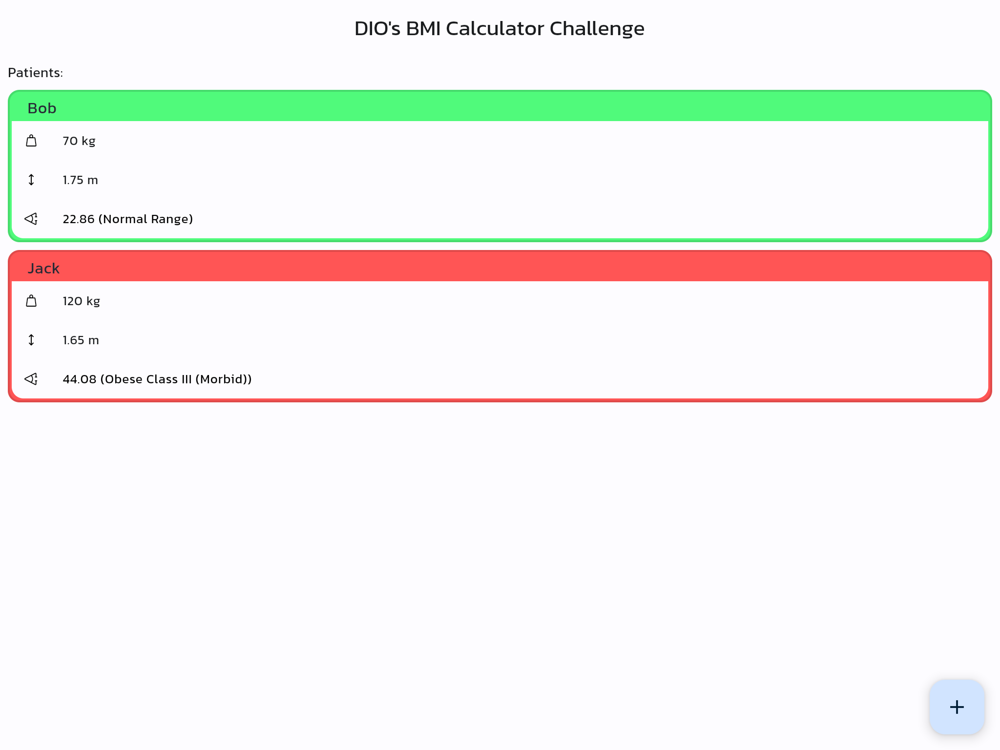
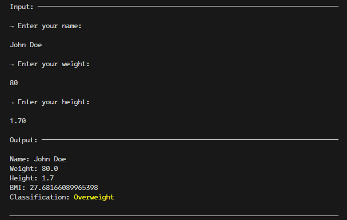

# DIO's BMI Calculator

This is the [Flutter Specialist Formation](https://www.dio.me/bootcamp/formacao-flutter-specialist)'s BMI Calculator challenge project from [Digital Innovation One](https://dio.me)

Flutter version:  

Dart only version:  

## Challenge Checklist

✅ Write data to Hive or SQLite

✅ Read configuration data using shared_preferences package

✅ Create Person class with Name, Weight and Height​

✅ Read input from Terminal​

✅ Exceptions Handling

✅ Calculate BMI​

✅ Print calculation result on screen

✅ Tests