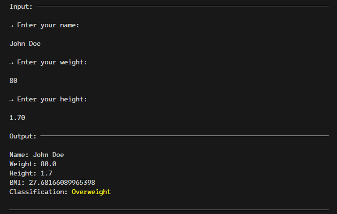

# DIO's BMI Calculator

This is the [Flutter Specialist Formation](https://www.dio.me/bootcamp/formacao-flutter-specialist)'s BMI Calculator challenge project from [Digital Innovation One](https://dio.me)

## Challenge Checklist
☑ Create Person class with Name, Weight and Height​

☑ Read input from Terminal​

☑ Exceptions Handling

☑ Calculate BMI​

☑ Print calculation result on screen

☑ Tests