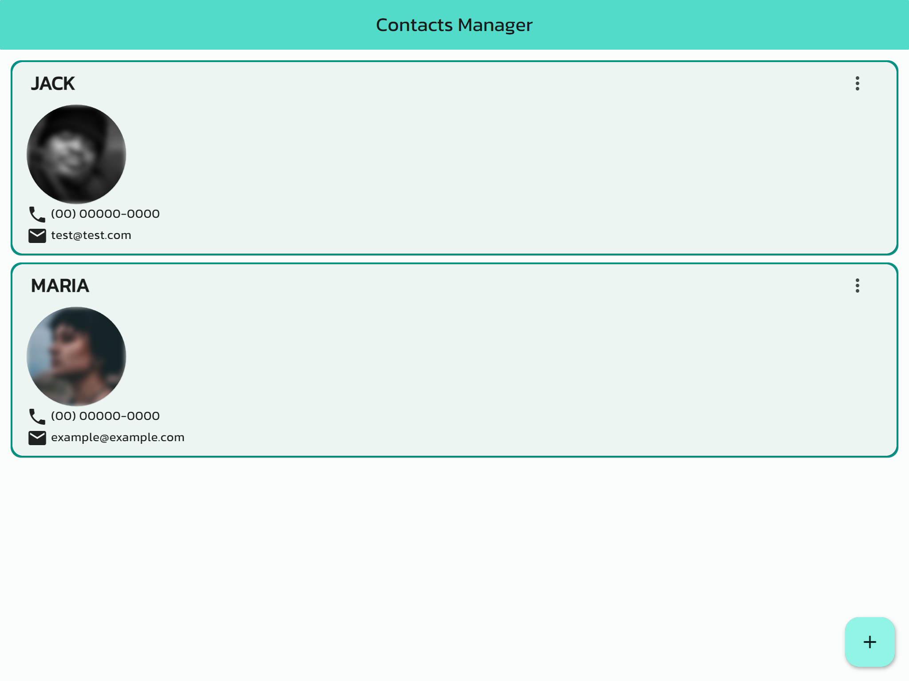

# DIO's Contact Manager challenge

This is the [Flutter Specialist Formation](https://www.dio.me/bootcamp/formacao-flutter-specialist)'s Contacts Manager challenge answer project from [Digital Innovation One](https://dio.me)

## Challenge Checklist

✅ Create a Flutter application

✅ Create an [Back4App](https://www.back4app.com/) database

✅ Registrate a Contact with profile photo

✅ Save image path only

✅ List contacts in a list with their respective photo

✅ Use the other components learned

## Bonus

GraphQL